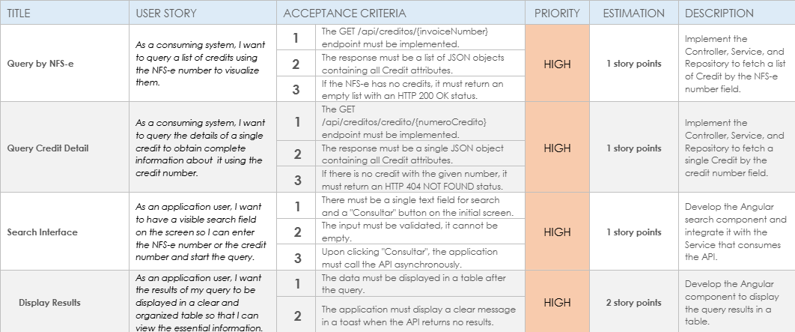
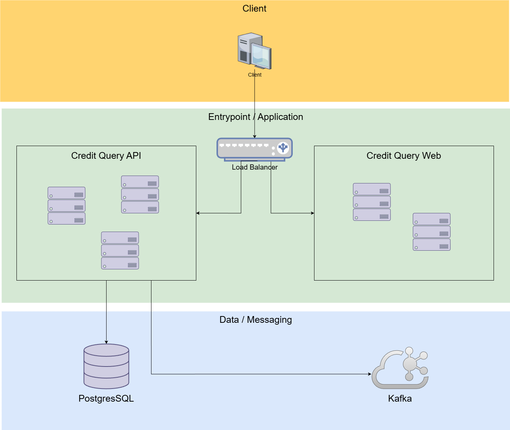

# Credit Query

This repository contains the API for the Credit Query system, which relies on Kafka and PostgreSQL and also the web application that consumes the API.

## User Stories



## Components



## Requirements

- Docker
- Docker Compose
- Git

## Step 1: Clone and Build the Web Application

First of all, starting from the root directory, it's necessary to build the Docker image of the web application with the followwing commands.

```bash
cd credit-query-web
docker build -t credit-query-web .
```

## Step 2: Clone and Build the API

In order to build the API Docker image execute the following commands starting from the root directory.

```bash
cd credit-query-api
docker build -t credit-query-api .
```

## Step 3: Run the services with Docker Compose

On the root directory, execute:

```bash
docker-compose up
```

This will start the following services:

Kafka (broker)

Kafka Init (topic creation)

Kafka UI (web interface for Kafka monitoring)

PostgreSQL (database)

DB Init (creation and population of the credit table)

Credit Query API (back-end application)

Credit Query Web (front-end application)

NGINX (load Balancer and reverse proxy)

## 🔗 Services

| Service           | Access URL                                         |
|-------------------|----------------------------------------------------|
| Web               | http://localhost                                   | 
| API               | http://localhost/api                               |
| Kafka UI          | http://localhost:8081                              |
| PostgreSQL        | jdbc:postgresql://localhost:5432/credit_query      |
| Kafka Broker      | localhost:9092 (external) / kafka:29092 (internal) |
| OpenAPI (Swagger) | http://localhost/swagger-ui.html                   |

## 📝 Notes

This project sets up a complete environment for developing and testing the **Credit Query** application, including:

- **Apache Kafka** for messaging.

- **Kafka UI** for viewing and managing topics.

- **PostgreSQL** as the database.

- **Credit Query** application containerized with Docker.

- **NGINX** load balancer to manage traffic between instances.

## ⚙️ Environment Variables

### Kafka

- `KAFKA_BOOTSTRAP_SERVER=kafka:29092`

Used by the application to connect to the Kafka broker.

### Database

- `SPRING_DATASOURCE_URL=jdbc:postgresql://postgres:5432/consulta_credito`

- `SPRING_DATASOURCE_USERNAME=postgres`

- `SPRING_DATASOURCE_PASSWORD=postgres`

## Executing tests

With the docker-compose services running, execute the following command to run the testers:

```bash
set KAFKA_BOOTSTRAP_SERVER=localhost:9092 && mvn test
```

> **⚠️ Note:** The command syntax may vary depending on your environment:
> - **Windows (CMD):** `set KAFKA_BOOTSTRAP_SERVER=localhost:9092 && mvn test`
> - **Windows (PowerShell):** `$env:KAFKA_BOOTSTRAP_SERVER="localhost:9092"; mvn test`
> - **Linux/Mac (Bash/Zsh):** `export KAFKA_BOOTSTRAP_SERVER=localhost:9092 && mvn test`
>
> Or run in a single line: `KAFKA_BOOTSTRAP_SERVER=localhost:9092 mvn test` (Linux/Mac only)